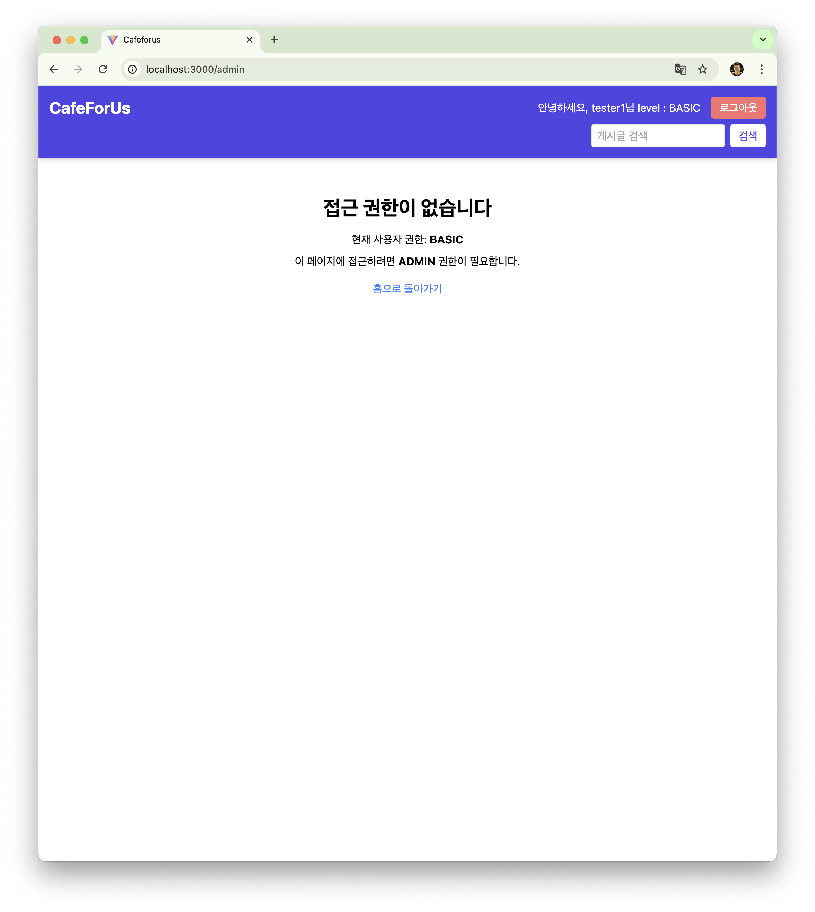

# ☕ CafeForUs – Social Community Platform

**CafeForUs** is a social content platform where users belonging to specific organizations can freely share and discuss coffee-related information and stories. It features strong admin and user control functionality such as user roles, content access restrictions by category, and user management tools.


---

## 🔑 Key Features Summary

| Feature                          | Description                                                                                               |
|----------------------------------|-----------------------------------------------------------------------------------------------------------|
| **Sign Up / Login**              | Email-based signup. Future plan to allow domain-based organization authentication.                       |
| **Board System**                 | Post creation, viewing, editing, and deletion. Includes comments and nested replies.                      |
| **Category Access Control**      | Access to categories and boards can be restricted by user level.                                          |
| **Admin Tools**                  | Admin dashboard to manage users, categories, and content.                                                 |
| **Group & 1:1 Chat (in development)** | Real-time chat functionality within groups or between individual users.                             |

---

## 🛠️ Tech Stack

### Frontend

- **React + TypeScript**: SPA structure for smooth UX  
- **React Router / Axios**: Routing and API communication

### Backend

- **Spring Boot + Java**: RESTful API server  
- **Spring Security**: Authentication and authorization  
- **JPA / MySQL**: ORM-based database management

---

## 🗂️ Core Features in Detail

### ✅ User Features

- Email-based signup & login  
- Organization affiliation authentication (planned via domain)  
- Create, edit, delete posts & comments  
- Access management by user role  
- Group and 1:1 chat (under development)

### ✅ Admin Features

- View, update, and delete user accounts  
- Create and manage categories  
- Moderate or remove posts  
- Handle user roles and content access

---

## 📁 Folder Structure

```plaintext
cafeforus/
├── cafeforus_front/   # React frontend
└── cafeForUs_back/    # Spring Boot backend
```

---

## 🚀 How to Run Locally

### Frontend

```bash
cd cafeforus_front
npm install
npm start
```

### Backend

```bash
cd cafeForUs_back
./gradlew bootRun
```

> ⚠️ Set up the database: Update MySQL connection info in `application.properties`.

---

## 📸 Screenshots

 |  User main page         | Admin main page         |
| ----------------------- | ----------------------- |
 |  |  |

| Chat              | Login                   | Post        |
| ----------------------- | ----------------------- | ----------------------- |
|  |  |  |

| AccesDenied page              | Category management                   | Level up request        |
| ----------------------- | ----------------------- | ----------------------- |
|  |  |  |

| User management              | Post management                   |
| ----------------------- | ----------------------- |
|  |  | 
---

## 📅 Development Progress

- [x] User authentication  
- [x] Board + comments system  
- [x] Admin dashboard  
- [x] Role-based access control  
- [ ] Domain-based org access  
- [ ] Group & 1:1 chat

---

